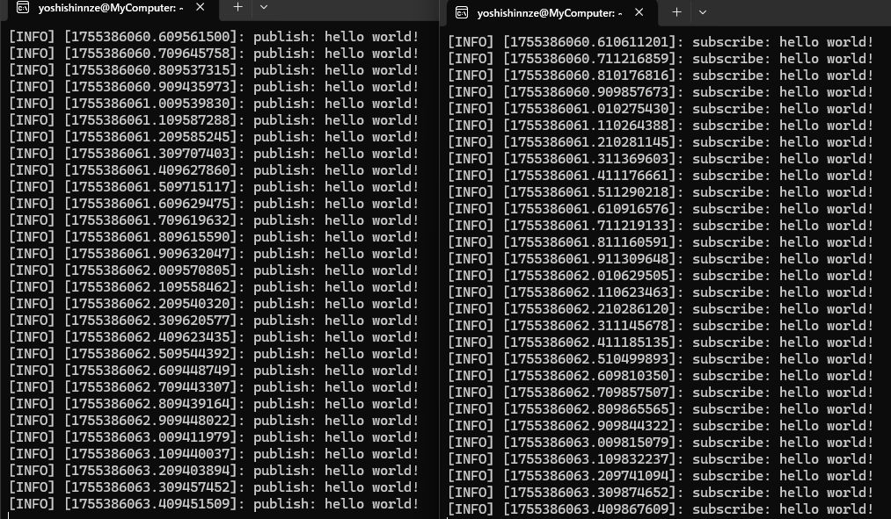

コードは記載されているものを使いまわし


## CmakeListの設定

パッケージ直下に `CmakeLists.txt`がありここにビルド用の情報を書き足します。今回の場合は `CmakeLists.txt`に以下の4行を書き加えるだけです。

```c
project(basic_lecture)

find_package(catkin REQUIRED COMPONENTS
  roscpp
  std_msgs
)

include_directories(
  ${catkin_INCLUDE_DIRS}
)

add_executable(basic_simple_talker   src/basic_simple_talker.cpp)
add_executable(basic_simple_listener src/basic_simple_listener.cpp)

target_link_libraries(basic_simple_talker
  ${catkin_LIBRARIES}
)
target_link_libraries(basic_simple_listener
  ${catkin_LIBRARIES}
)

```


その後、ビルドします。

```
cd ~/catkin_ws
catkin build

```


特定のフォルダのみビルドする方法

```shell
catkin_make --pkg <package_name>

```

```shell
catkin build basic_simple_talker
```

したのコマンドがビルド通った。

基本'catkin build パッケージ名'とする。


## ないといわれる

いい質問です 👍

ログを見ると、エラーの原因は次の通りです：

```
catkin build basic_simple_talker
[build] Error: Given package 'basic_simple_talker' is not in the workspace and pattern does not match any package
```

つまり **`basic_simple_talker` という名前のパッケージは存在しない** ということです。

---

## ポイント整理

1. **`rosrun` の使い方**

   ```
   rosrun <package_name> <executable_name>
   ```

   * `<package_name>` → `package.xml` に書かれたパッケージ名
   * `<executable_name>` → `CMakeLists.txt` の `add_executable()` で作られて `catkin_install_python()` や `catkin_install_targets()` でインストールされるもの

   あなたのコマンドは：

   ```bash
   rosrun basic_lecture basic_simple_talker
   ```

   → これは「パッケージ `basic_lecture` の中に `basic_simple_talker` という実行ファイルがある」前提です。
2. **エラーメッセージ**

   ```
   Couldn't find executable named basic_simple_talker below .../src/ros_lecture/basic_lecture
   ```

   → `basic_lecture` というパッケージはあるけど、そこに `basic_simple_talker` という実行ファイルが見つからない。
3. **`catkin build` 側のエラー**

   ```
   Error: Given package 'basic_simple_talker' is not in the workspace
   ```

   → `basic_simple_talker` を「パッケージ」として指定したが、実際は「ノード（実行ファイル名）」であってパッケージではない。

---

## まとめると

* `basic_simple_talker` は **パッケージ名ではなく実行ファイル名**
* 実行するにはパッケージ名（ここでは `basic_lecture`）を使う必要がある

---

## 確認すべきこと

1. **パッケージの名前確認**

   ```bash
   rospack list | grep basic_lecture
   ```

   → `basic_lecture` が存在するかチェック
2. **ビルドされているか確認**

   ```bash
   catkin build basic_lecture
   ```
3. **実行ファイルができているか確認**

   ```bash
   ls ~/catkin_ws/devel/lib/basic_lecture/
   ```

   → `basic_simple_talker` があるかどうか

   なければ、`CMakeLists.txt` に以下のような設定があるか確認してください：

   ```cmake
   add_executable(basic_simple_talker src/basic_simple_talker.cpp)
   target_link_libraries(basic_simple_talker ${catkin_LIBRARIES})
   ```

---

✅ 結論:

* `basic_simple_talker` は「パッケージ」ではなく「ノード（実行ファイル）」
* `catkin build basic_simple_talker` ではなく

  ```bash
  catkin build basic_lecture
  ```

  とすべきです。

---

👉 `src/ros_lecture/basic_lecture` の中の **CMakeLists.txt の該当部分** を見せてもらえますか？

そこを見れば、ノードがちゃんとビルド対象になっているか確認できます。


## 結論

ビルドをcatkin build <パッケージ名>としたら実行出来るようになった





いつも実行前に行う

- rosノードを実行するためにはあらかじめroscoreを実行する必要があります。→通信の司令塔。これがないと各ノードの名前解決が出来なくなる。
- 各ターミナルごとに実行前に `source ~/catkin_ws/devel/setup.bash`→ROSが `ROS_PACKAGE_PATH`を探す際のパスを設定する行為。これによりROSがパッケージを見つけられるようになる

この辺りの意味を確認しておく→OK
