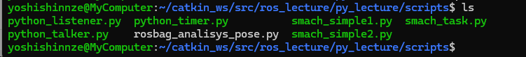

## 目的

rosのpythonスクリプトをlinux中で動作させる手順を理解する

## 実行権限の付与

pythonはスクリプト言語なのでこれ自体はビルドは必要ありません。ただpythonファイルを実行するためには実行権限を付ける必要があります。

```shell
roscd py_lecture/scripts/
chmod +x python_talker.py 
chmod +x python_listener.py 
```



# 実行

各ターミナルごとに実行前に `source ~/catkin_ws/devel/setup.bash`を実行する必要があります。

**1つ目のターミナル**

```shell
roscore
```

**2つ目のターミナル**

```
rosrun py_lecture python_talker.py _content:=data
```

**3つ目のターミナル**

```
rosrun py_lecture python_listener.py
```

```shell
catkin_ws/src/ros_lecture/py_lecture/scripts
```

## 結果：動作しました

talker: send: dataという文字列データをpublish

listener: publishされたデータを受け取って、表示。さらに受け取った日時を表示

3つめのpython_timerの動作が謎・・・


① **talker.py**

```python
rospy.init_node('talker')
word = rospy.get_param("~content", "default")
pub = rospy.Publisher('chatter', String, queue_size=10)

```

- ノード初期化：talker
- パラメータ取得：contentからメッセージ取得
- publisher作成：/chatterトピックにstringメッセージ送信する

```python
r = rospy.Rate(1) # 1Hz
while not rospy.is_shutdown():
    str = "send: %s" % word
    rospy.loginfo(str)
    pub.publish(str)
    r.sleep()

```

* 1秒に1回、文字列を `/chatter` に送信
* Ctrl+Cで終了するまで送信し続ける

②litener.py

基本的にずっと聞き続けるノード。

chatterトピックを購読して、届いたらcallbackを実行

```python
rospy.init_node('listener')
rospy.Subscriber("chatter", String, callback)
rospy.spin()
```


* **ノード初期化** : 名前は `"listener"`
* **Subscriber作成** : `/chatter` トピックを購読して、届いたら `callback` を実行
* **spin()** : 無限ループに入り、コールバック待機

```python
def callback(data):
    rospy.loginfo("recieved %s", data.data)
    now = rospy.Time.now()
    rospy.loginfo("now: %f", now.to_sec())
```

- 受信メッセージをログ出力
- メッセージの時刻を取得してログ出力


1. 使う場合はまずノードを定義
2. メッセージを送るときはpublisher/subscriberを定義
3. トピックは2を定義した際に自動的に定義される


## エラー

Unable to locate package ros-noetic-desktop-full

When you encounter the error message "unable to locate package ros-noetic-desktop-full" while trying to install ROS Noetic, it indicates that the package is not available in your system's package repository.

Example

**sudo** apt **install** ros-noetic-desktop-full

Reading package lists... Done

Building dependency tree

Reading state information... Done

E: Unable to **locate** package ros-noetic-desktop-full

Steps to Resolve the Issue

1. Update Package Lists

Ensure your package lists are up-to-date by running:

**sudo** apt update

2. Add ROS Repository

Add the ROS repository to your system:

**sudo** sh -c **'echo "deb http://packages.ros.org/ros/ubuntu $(lsb_release -sc) main" > /etc/apt/sources.list.d/ros-latest.list'**

Then, add the ROS key:

**sudo** apt-key adv --keyserver **'hkp://keyserver.ubuntu.com:80'** --recv-key C1CF6E31E6BADE8868B172B4F42ED6FBAB17C654

3. Install ros-noetic-desktop-full

After updating the package lists and adding the ROS repository, install the package:

**sudo** apt update

**sudo** apt **install** ros-noetic-desktop-full

4. Verify Installation

To verify that ROS Noetic is installed correctly, run:

**source** /opt/ros/noetic/setup.**bash**

Add this line to your *.bashrc* file to source it automatically:

**echo** **"source /opt/ros/noetic/setup.bash"** >> ~/.bashrc

**source** ~/.bashrc

By following these steps, you should be able to resolve the "unable to locate package ros-noetic-desktop-full" error and successfully install ROS Noetic on your system
